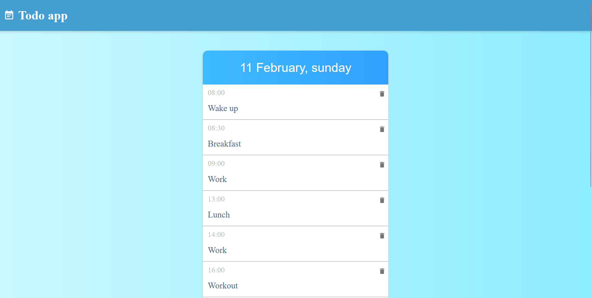
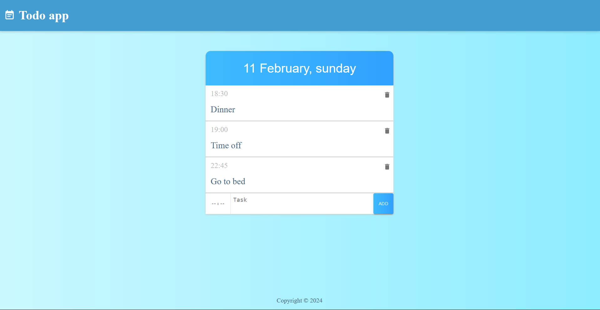

    <h2>Todo App preview</h2>

    <h2>Same page after deleting some tasks</h2>

## How to install Todo App?

1. Common setup. Clone the repository and install the dependencies.
   - git clone https://github.com/Xenko10/todo-app.git
   - cd todo-app
   - yarn
2. Run the following.
   - yarn start
   - open http://localhost:5173
